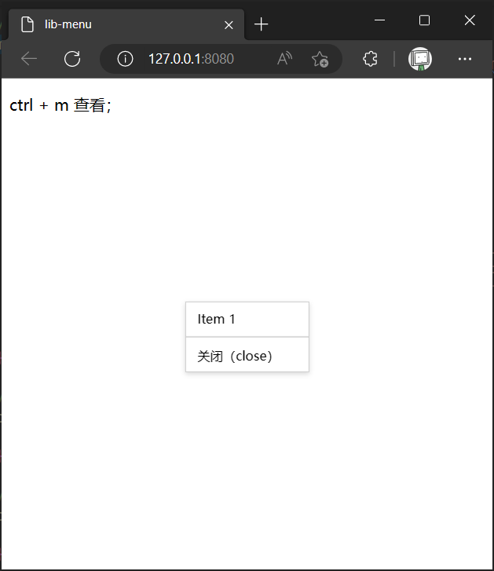

## lib-menu

一个居中显示的菜单，使用 `ctrl + m` 快捷键打开。

## 示例

```html
  <p>ctrl + m 查看；</p>

  <script src="dist/lib-menu.js"></script>
  <script>
    // 定义菜单项
    const demoItems = [
      {
        name: "Item 1",
        fn: () => {
          console.log("Item 1 clicked");
        },
      },
      {}
    ];
    // 实例化菜单
    const demoMenu = new mzLibMenu({ items: demoItems });
  </script>
```



## 感谢

mturco/context-menu: A small JavaScript library for adding context menus to any HTML element：

[https://github.com/mturco/context-menu](https://github.com/mturco/context-menu "mturco/context-menu: A small JavaScript library for adding context menus to any HTML element")
