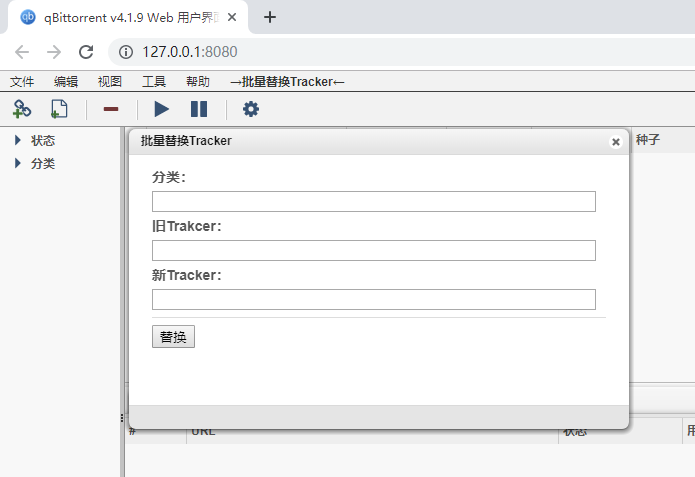

## 使用

### 开发时 CSP 限制解除

字段名：

> content-security-policy

原始值：

> default-src 'self'; style-src 'self' 'unsafe-inline'; img-src 'self' data:; script-src 'self' 'unsafe-inline'; object-src 'none'; form-action 'self'; frame-ancestors 'self';

更新为：

> default-src 'self'; style-src 'self' 'unsafe-inline'; img-src 'self' data:; script-src 'self' 'unsafe-inline' localhost:3000; object-src 'none'; form-action 'self'; frame-ancestors 'self'; connect-src 'self' ws://localhost:3000;

----

> 「折腾」使用浏览器自带功能修改网站「响应标头」\_电脑网络\_沉冰浮水：
>
> [https://www.wdssmq.com/post/20120902324.html](https://www.wdssmq.com/post/20120902324.html "「折腾」使用浏览器自带功能修改网站「响应标头」\_电脑网络\_沉冰浮水")

### 其他

> The Content-Security-Policy directive name 'content-security-policy:' contains one or more invalid characters. Only ASCII alphanumeric characters or dashes '-' are allowed in directive names.

如果遇到上边报错，那是因为把 `content-security-policy:` 在字段值也写了一遍，去掉就好了；「- -」
